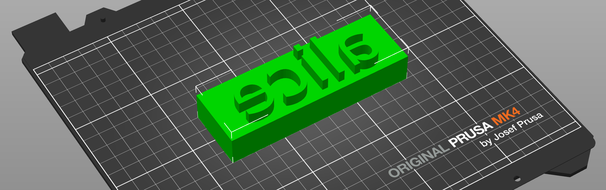

# Erika's Little STL Factory
#### OpenSCAD 3D models and scripts for generating STL files for 3D printing.

Each folder in this repository contains a different parametrized OpenSCAD project and one or more bash scripts to facilitate generating custom STL models out of it. The models are designed to be easily customizable, allowing you to create unique designs for 3D printing. You can use the included Docker setup to build the STL files with OpenSCAD without having to install it on your main system.

## Setup with Docker
The following command will build an OpenScad container image and land you in a shell where you can use the included scripts to generate your models:

```bash
make openscad
```
```shell
Building OpenSCAD container...
docker build --build-arg uid=${UID} . -t openscad.local
[+] Building 1.4s (7/7) FINISHED                                                                                                   docker:default
 => [internal] load build definition from Dockerfile                                                                                         0.0s
 => => transferring dockerfile: 210B                                                                                                         0.0s
 => [internal] load metadata for docker.io/openscad/openscad:latest                                                                          1.2s
 => [internal] load .dockerignore                                                                                                            0.0s
 => => transferring context: 2B                                                                                                              0.0s
 => [1/3] FROM docker.io/openscad/openscad:latest@sha256:147e48525bec392bcf628d7a6d5ea4ccac71b16251952328f86e1061cbf47c37                    0.0s
 => CACHED [2/3] WORKDIR /openscad                                                                                                           0.0s
 => CACHED [3/3] RUN useradd -u 1000 -m -d /openscad openscad &&     chown -R openscad:openscad /openscad                                    0.0s
 => exporting to image                                                                                                                       0.0s
 => => exporting layers                                                                                                                      0.0s
 => => writing image sha256:46b0c3800c5a01133892e5035b0f5a7e594d2a7e6ff984170155270ec8912f0e                                                 0.0s
 => => naming to docker.io/library/openscad.local                                                                                            0.0s
Running OpenSCAD Container...
docker run --rm -v $PWD:/openscad \
	-it --entrypoint /bin/sh openscad.local
$ 

```

From this shell, you can access all folders in this repository and run the included scripts to generate your STL files. Each model has its own parameters and instructions.

## Text2Stamp
This project generates 3D stamps from text. It uses OpenSCAD to create the models and export them in STL format. 



After landing in the shell, you can use the convenient `t2s` script to generate a stamp from text. For example:

```bash
cd text2stamp
./t2s --stamp alice --size 30
```

You'll get output similar to this:

```bash
Generating Stamp 'alice' with size 30...
ECHO: version = [2021, 1, 0]
Geometries in cache: 4
Geometry cache size in bytes: 71896
CGAL Polyhedrons in cache: 1
CGAL cache size in bytes: 642384
Total rendering time: 0:00:00.277
   Top level object is a 3D object:
   Simple:        yes
   Vertices:      476
   Halfedges:    1428
   Edges:         714
   Halffacets:    496
   Facets:        248
   Volumes:         2
Stamp 'alice' generated successfully as 'out/alice.stl'.

```

STL files are saved with the same name as your stamp text, in the `out` folder. If you check the `text2stamp/out` directory, you will find the generated `alice.stl` file. You can use this file to 3D print your custom stamp.

When no parameters are passed, the script will prompt you for the stamp text and size and output the generated model in the `out` directory:

```bash
$ ./t2s
Enter stamp (default: printables): erika
Enter size (default: 30): 
Generating Stamp 'erika' with size 30...
ECHO: version = [2021, 1, 0]
Geometries in cache: 4
Geometry cache size in bytes: 65512
CGAL Polyhedrons in cache: 1
CGAL cache size in bytes: 585936
Total rendering time: 0:00:00.261
   Top level object is a 3D object:
   Simple:        yes
   Vertices:      434
   Halfedges:    1302
   Edges:         651
   Halffacets:    454
   Facets:        227
   Volumes:         2
Stamp 'erika' generated successfully as 'out/erika.stl'.

```

### Using OpenSCAD directly

If you have OpenSCAD installed on your system, you can either use the `t2s` script or use openscad directly to generate the model. This can be done via their graphic interface or via command line. From the command line, you can use the following command to generate a stamp with the text "stamptext" and size 20. The generated model will be saved as `out/mystamp.stl`.:

```bash
openscad -o "out/mystamp.stl" -D "stamp=\"stamptext\"" -D "size=20" base-stamp.scad
```
