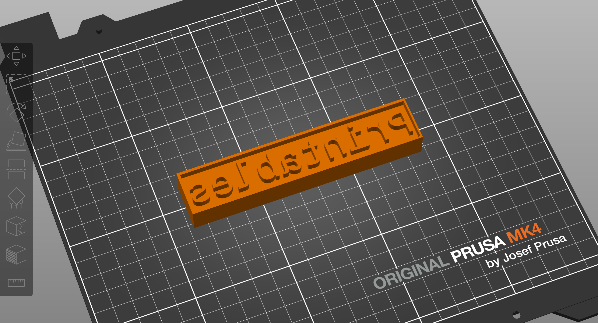

# Erika's Little STL Factory
#### OpenSCAD 3D models and scripts for generating STL files for 3D printing.

Each folder in this repository contains a different parametrized OpenSCAD project and one or more bash scripts to facilitate generating custom STL models out of it. The models are designed to be easily customizable, allowing you to create unique designs for 3D printing. You can use the included Docker setup to build the STL files with OpenSCAD without having to install it on your main system.

## Setup with Docker
The following command will build an OpenScad container image and land you in a shell where you can navigate the repository folders and build your STL files. Each folder contains a README file with instructions on how to use the scripts.

```bash
make openscad
```
```shell
Building OpenSCAD container...
docker build --build-arg uid=${UID} . -t openscad.local
[+] Building 1.4s (7/7) FINISHED                                                                                                   docker:default
 => [internal] load build definition from Dockerfile                                                                                         0.0s
 => => transferring dockerfile: 210B                                                                                                         0.0s
 => [internal] load metadata for docker.io/openscad/openscad:latest                                                                          1.2s
 => [internal] load .dockerignore                                                                                                            0.0s
 => => transferring context: 2B                                                                                                              0.0s
 => [1/3] FROM docker.io/openscad/openscad:latest@sha256:147e48525bec392bcf628d7a6d5ea4ccac71b16251952328f86e1061cbf47c37                    0.0s
 => CACHED [2/3] WORKDIR /openscad                                                                                                           0.0s
 => CACHED [3/3] RUN useradd -u 1000 -m -d /openscad openscad &&     chown -R openscad:openscad /openscad                                    0.0s
 => exporting to image                                                                                                                       0.0s
 => => exporting layers                                                                                                                      0.0s
 => => writing image sha256:46b0c3800c5a01133892e5035b0f5a7e594d2a7e6ff984170155270ec8912f0e                                                 0.0s
 => => naming to docker.io/library/openscad.local                                                                                            0.0s
Running OpenSCAD Container...
docker run --rm -v $PWD:/openscad \
	-it --entrypoint /bin/sh openscad.local
$ 

```

From this shell, you can access all folders in this repository and run the included scripts to generate your STL files. Each model has its own parameters and instructions.

## [Text2Stamp](text2stamp/README.md)
This project generates 3D stamps from text. It uses OpenSCAD to create the models and export them in STL format, including a bash script to help you customize the generated models. You can also open the model directly in OpenSCAD and use the GUI to modify the parameters and generate your custom STLs.



Check the [Text2Stamp](text2stamp/README.md) subfolder for details on how to use it.

