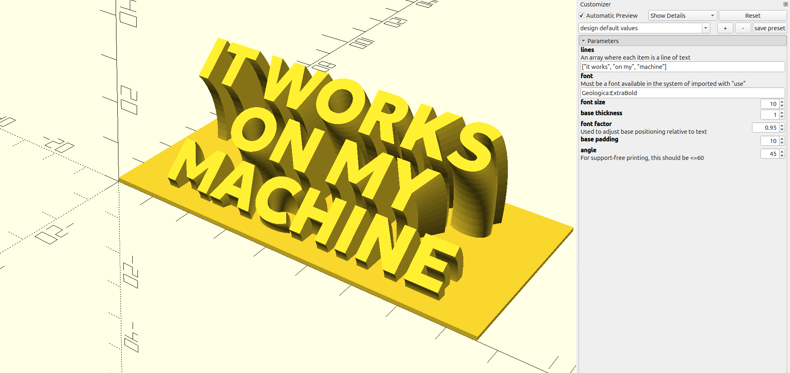

# Motivational Sign Maker (RevolvingText)
This project includes an OpenScad model that generates 3D signs from text.

## Requirements
- OpenSCAD, but can also run via Docker (in this case you need to use OpenSCAD in the command line).

## Examples
The `examples` folder contains several pre-generated STL models that you can print directly.

### Model Parameters
From the GUI, open the `text.scad` file in OpenSCAD. You can modify all parameters in the right sidebar of the OpenSCAD window. The parameters you can modify are:   
- `lines`: An array with each line of text you want to use for the sign. Default value is `["it works", "on my", "machine"]`.
- `font`: The font used for the sign. The default value is `Geologica:ExtraBold`, which is a `.ttf` font included within the 'fonts' folder. Notice the font is imported through a `use` statement. You can do something similar to use a different font. You can also use system fonts by specifying the font name in the `font` parameter. For example, `Liberation Sans`.
- `font_size`: The approximate font size for the sign. Default value is `10`.
- `base_thickness`: The thickness of base. Default value is `1`.
- `font_factor`: A factor to calculate the font width size, used to centralize the text in the base. Default value is `0.90`, which is a good value for most fonts. You can modify this value to adjust the base width.
- `base_padding`: The padding between the text and the base. Default value is `10`.
- `angle`: The angle of the text. Default value is `45`. Please note that for support-free printing, the angle should not pass 60 degrees. 

After you're satisfied with the model, first render it by pressing `F6`, than you can export it as an STL file by clicking on `File` -> `Export` -> `Export as STL...` in the OpenSCAD GUI.