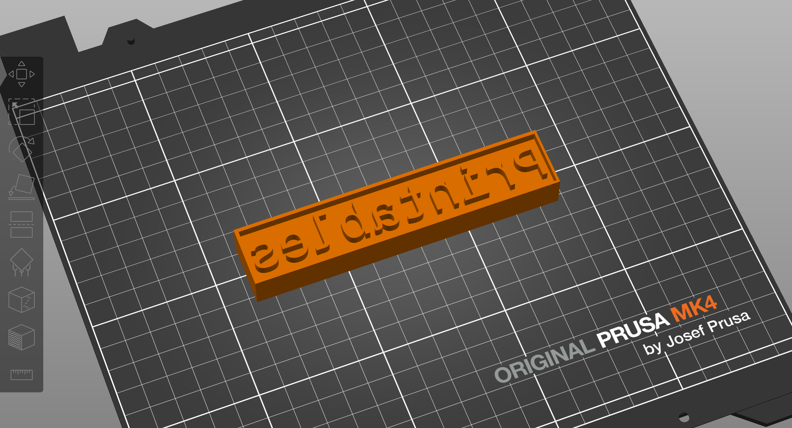

# Text2Stamp
This project includes an OpenScad model that generates 3D stamps from text, and a convenient bash script to help you in customizing the generated models. You can also open the model directly on OpenScad and use the GUI to modify the parameters and generate your custom STLs.




## Requirements
- a Shell
- OpenSCAD, but can also run via Docker.

## Usage

```bash
cd text2stamp
./t2s --stamp alice --size 30
```

You'll get output similar to this:

```bash
Generating Stamp 'alice' with size 30...
ECHO: version = [2021, 1, 0]
Geometries in cache: 4
Geometry cache size in bytes: 71896
CGAL Polyhedrons in cache: 1
CGAL cache size in bytes: 642384
Total rendering time: 0:00:00.277
   Top level object is a 3D object:
   Simple:        yes
   Vertices:      476
   Halfedges:    1428
   Edges:         714
   Halffacets:    496
   Facets:        248
   Volumes:         2
Stamp 'alice' generated successfully as 'out/alice.stl'.

```

To be prompted for the values needed to generate the stamp, just run the script without any parameters:

```bash
$ ./t2s
Enter stamp (default: printables): erika
Enter size (default: 30): 
Generating Stamp 'erika' with size 30...
ECHO: version = [2021, 1, 0]
Geometries in cache: 4
Geometry cache size in bytes: 65512
CGAL Polyhedrons in cache: 1
CGAL cache size in bytes: 585936
Total rendering time: 0:00:00.261
   Top level object is a 3D object:
   Simple:        yes
   Vertices:      434
   Halfedges:    1302
   Edges:         651
   Halffacets:    454
   Facets:        227
   Volumes:         2
Stamp 'erika' generated successfully as 'out/erika.stl'.

```

## Batch Scripts
Some example scripts for batch stamp generation were included in the `examples` folder:

- `alpha-gen.sh`: Generates a stamp for each letter of the alphabet.
- `words-gen.sh`: Generates a stamp for each word listed in the `words.txt` file. You can modify the file `words.txt` to use your own list of words.

### alpha-gen.sh Usage

```bash
./scripts/alpha-gen.sh
```
This will generate an STL file for each letter of the alphabet and output the files to `examples/alphabet`.

### words-gen.sh Usage

```bash
./scripts/words-gen.sh
```

This will generate an STL file for each word in the `scripts/words.txt` file. Files will be saved to the `examples/words` folder. You can modify the `words.txt` file to use your own list of words.


## Using OpenSCAD directly

If you have OpenSCAD installed on your system, you can either run the `t2s` script or use OpenSCAD directly to generate the model. This can be done via their graphic interface or via command line. 

### Model Parameters
From the GUI, open the `base-stamp.scad` file in OpenSCAD. You can modify all parameters in the right sidebar of the OpenSCAD window. The parameters you can modify are:   
- `stamp`: A string with the text you want to use for the stamp. Default value is `printables`.
- `size`: The approximate font size for the stamp. Default value is `30`.
- `thickness`: The thickness of the stamp. Default value is `20`.
- `font`: The font used for the stamp. Default value is `Liberation Mono`.
- `withborder`: A boolean value to add a border around the stamp. Default value is `false`.

For automation and batch model generation, it's best to use OpenSCAD from the command line. You can use the following command to generate a stamp with the text "printables" and size 20. The generated model will be saved as `out/printables.stl`.:

```bash
openscad -o "out/printables.stl" -D "stamp=\"printables\"" -D "size=20" base-stamp.scad
```

Pay special attention to the quotes around the `stamp` parameter. When using OpenSCAD directly from the command line, you'll need to make sure to escape the quotes around the string. If you want to use a different font, you can specify it with the `font` parameter. For example, to use the `Liberation Sans` font, you can run:

```bash
openscad -o "out/printables.stl" -D "stamp=\"printables\"" -D "size=20" -D "font=\"Liberation Sans\"" base-stamp.scad
```

```bash

## Available Fonts
The fonts available for the stamp are the ones installed on your system. The most portable options are the fonts included by OpenSCAD: _Liberation Mono, Liberation Sans, and Liberation Serif_. These are more likely to be portable across systems. You can check the fonts available on your system by running the following command:

```bash
fc-list -f "%-60{{%{family[0]}%{:style[0]=}}}%{file}\n" | sort
```

This will list all the fonts installed on your system, along with their file paths. You can use any of these fonts in the `font` parameter (including a particular style) when generating the stamp. 